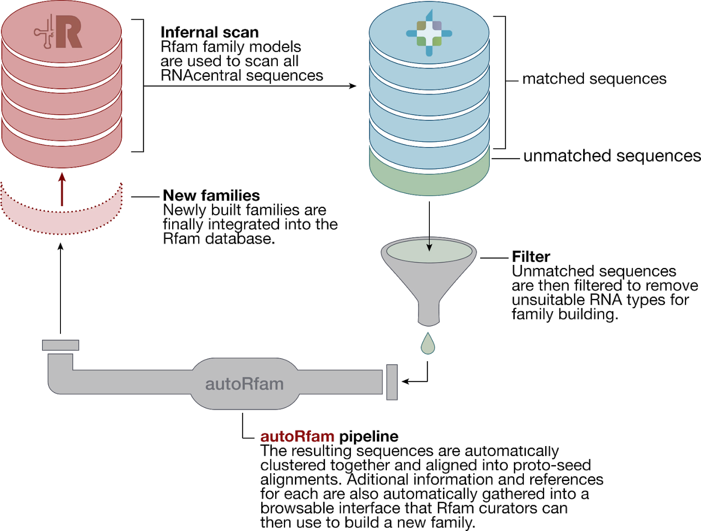

# autoRfam
[autoRfam](https://github.com/nataquinones/autoRfam) is a pipeline that groups RNA sequences into potential new Rfam families. The idea was that we could use RNA sequences from [RNAcentral](https://rnacentral.org/) that didn't match any existing [Rfam](https://rfam.xfam.org/) family as a source for new families.

I worked on this project during my time as an intern at the European Bioinformatics Institute, under the supervision of [Alex Bateman](https://www.ebi.ac.uk/about/people/alex-bateman) and [Anton Petrov](https://www.ebi.ac.uk/about/people/anton-petrov). It is a simple project, but it was my first *"real"* bioinformatics project and I learned a lot from it, so it holds a special place in my heart. Part of this work ended up in a the Rfam 13.0 paper, which you can read [here](https://academic.oup.com/nar/article/46/D1/D335/4588106).

It starts with a list of RNAcentral unique sequence identifiers, aligns them, selects the most relevant alignments, recollects important information about the sequences such as alignment statistics, annotations, publications, secondary structure prediction, coding potential, etc. Finally, it makes this information browsable through html pages, which a curator can use to build new families.

    

