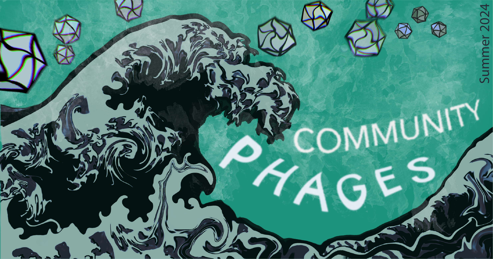

# Community Phages

*Community Phages* is a summer research internship that brings together undergraduate students from Roxbury Community College and researchers at Harvard Medical School to discover novel bacteriophages. I helped design, organize, and run the first iteration of the program in 2022, and continued to support it in 2023. I was closely involved in developing both the lab and bioinformatics components of the program, and led the instruction of the bioinformatics curriculum during the first two years.

I also built the program website, which hosts publicly available protocols for the course, and serves as a central hub for resources throughout the 8-week program. It’s been one of my favorite teaching and mentorship experiences.

- Check more information about the program at: [phages.hms.harvard.edu](https://phages.hms.harvard.edu/)