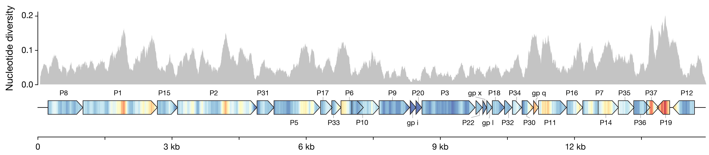
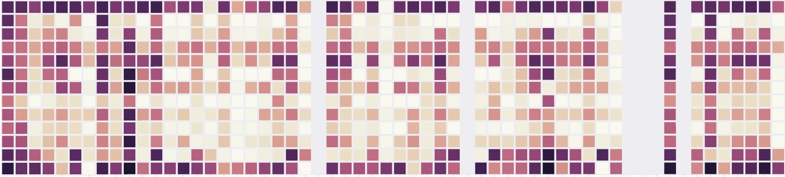

# Plasmid-dependent phages

---

- Read the paper:
>[Diverse and abundant phages exploit conjugative plasmids](https://www.nature.com/articles/s41467-024-47416-z)
 *Nature Communications* (2024)

- Here's the [github repo](https://github.com/baymlab/2023_QuinonesOlvera-Owen) with all the code to reproduce the figures in the paper.

## Visualization for nucleotide diversity
We wanted to compare a bunch of closely related genomes and figure out which genes showed the most variation. Nucleotide diversity is a common metric for this, but I thought I could do a better-looking and more helpful way to show it than just dropping a histogram over the genes. I mapped the values to a color scale with `matplolib.cm`, and drew a kind of pseudo-heatmap using vertical lines. Then I plotted the gene bodies with `dna_features_viewer` to keep everything nicely aligned, and overlaid the two *in post*. I think it turned out pretty neat, and it's much easier to read the value in the gene context. 
- [Snakemake pipeline](https://github.com/baymlab/2023_QuinonesOlvera-Owen/blob/main/figures/Fig2/nucleotide_diversity/figure_ndiv.smk) to align whole genomes and compute nucleotide diversity.
- [Notebook](https://github.com/baymlab/2023_QuinonesOlvera-Owen/blob/main/figures/Fig2/nucleotide_diversity/notebooks/nucleotide_diversity.ipynb) to produce the figure.

## Liquid assay score from growth curves
In this project, I wanted to compare phage susceptibility across 13 different bacterial species for 52 phages. I initially tried plaque assays (something my lab was uniquely equipped to handle at that scale), but despite what people often claim, plaque assays aren’t really good quantitative measurements. After painstaking attempts to get accurate and reproducible numbers, I became convinced it’s just not an appropriate method for sensitive comparisons (there’s just too much noise in the assay, and you also can’t meaningfully or quantitatively capture things like plaque size or cloudiness.) So, I pivoted to using growth curves in liquid culture. That method has its own limitations, but it's at least internally consistent, comparable across samples, and much less hands-on thanks to a little army of 96-well plate readers. Still, I ran everything in triplicate, which meant over 2,000 individual growth curves, each running for about 12 hours. 

I ended writing some code base to process this growth curve data into a "Liquid Assay Score", as defined and nicely validated by [Xie, *et. al* (2018)](https://pubmed.ncbi.nlm.nih.gov/29649135/). Also, I actually uploaded ALL the raw growth curve data from these experiments, thinking that it could be a cool resource for someone trying to train or model these sorts of lysis dynamics.
- [Notebook](https://github.com/baymlab/2023_QuinonesOlvera-Owen/blob/main/figures/Fig3/notebooks/heatmap.ipynb) calculating the Liquid Assay Score and making heatmap.
- [Notebook](https://github.com/baymlab/2023_QuinonesOlvera-Owen/blob/main/figures/Fig3/notebooks/concept_curves.ipynb) with example on how to plot individual curves
- [Raw data](https://github.com/baymlab/2023_QuinonesOlvera-Owen/blob/main/figures/Fig3/data/all_growthcurves.tsv) of all the growth curves

