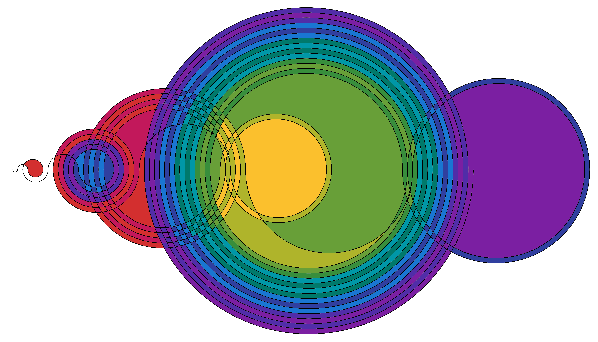

A Jupyter Notebook that generates [Recamán's sequence](http://oeis.org/wiki/Recam%C3%A1n%27s_sequence) and draws Edmund Harriss' diagram as shown in in [Numberphile's video](https://www.youtube.com/watch?v=FGC5TdIiT9U).

 

